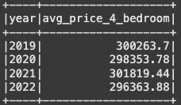
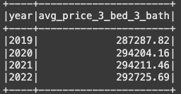
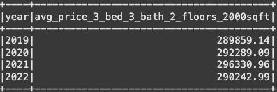
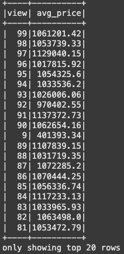

# Home_Sales
Module 22 Challenge SparkSQL

This project explores SparkSQL, implemented on [colab](https://colab.research.google.com/), to analize home sales data.

## Files
- Home_Sales_colab.ipynb
- images/*.png

## Highlights

## Acknoledgements
- This project was created as part of the EdX Data Analytics Bootcamp

## Author
Andrew Lane, 2025 
[@andrewplane](https://github.com/andrewplane)